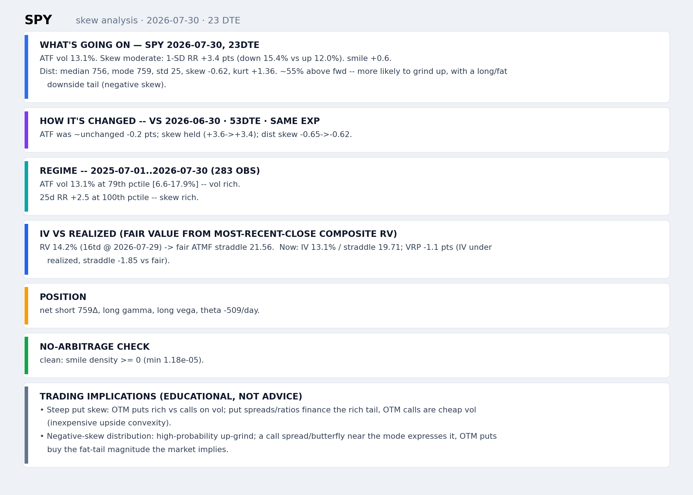
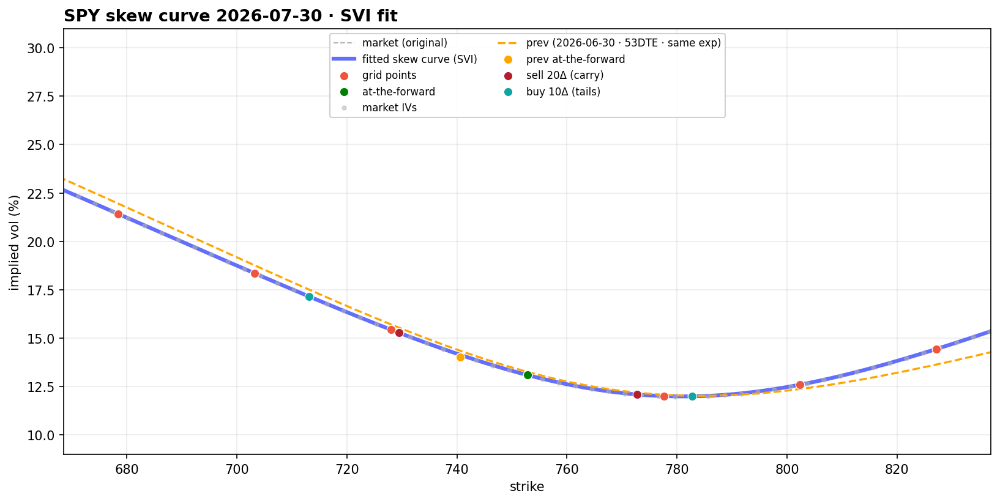
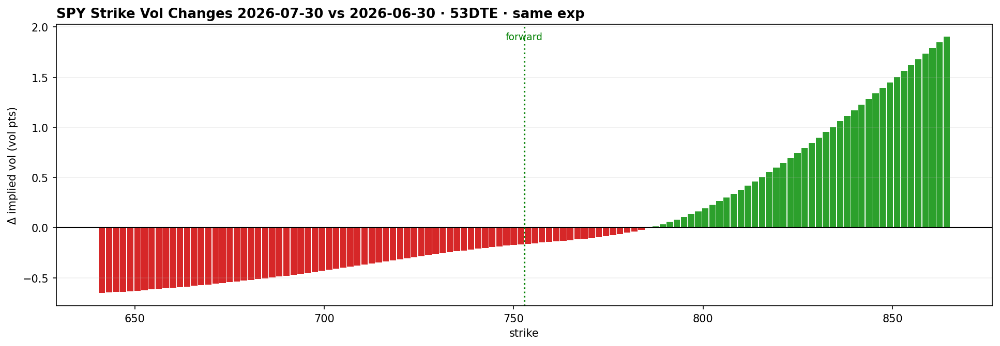
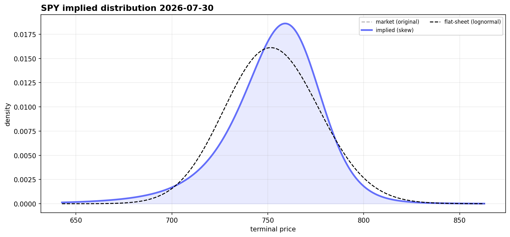
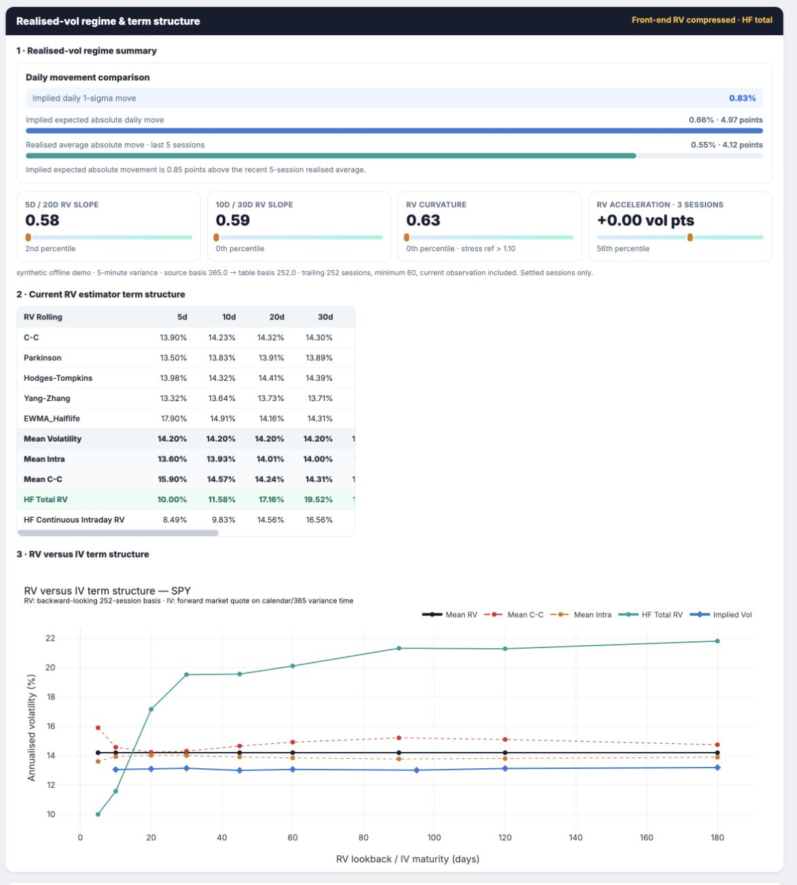
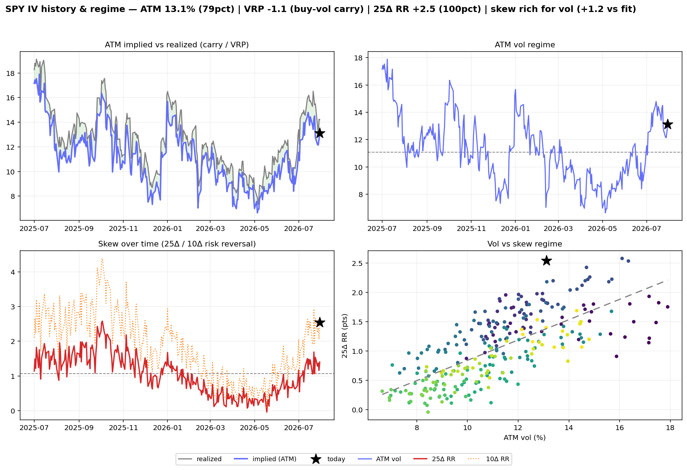
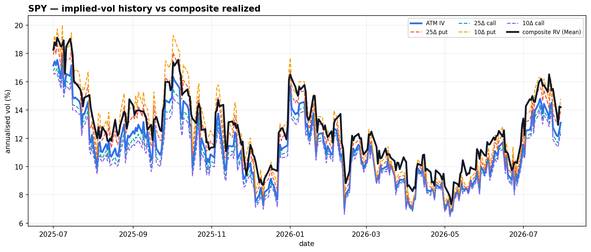
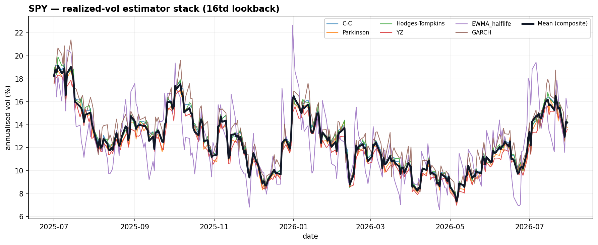

# skewlab

**An arbitrage-aware option skew and volatility dashboard.** It fits the implied smile with
SVI, recovers the risk-neutral density, checks the smile for arbitrage, and compares implied
volatility with realized-volatility levels, regimes, and term structures. Everything renders
in an interactive Dash app.

[](https://github.com/reubenB412/skewlab/actions/workflows/ci.yml)


> **Runs offline.** This public demo uses a deterministic synthetic adapter: no network,
> credentials, market-data terminal, or local portfolio files are read.



*The written read that ties the panels together: what's going on, how it changed vs the prior
observation, regime percentiles, the book's greeks, the no-arbitrage check, and the RV-vs-IV
fair value. The dashboard renders the same narrative as cards.*



*The skew panel from the offline demo (`python skewlab.py`, no credentials): a raw-SVI fit
with a steep put wing at ATF ≈ 13%, plus previous-day and term-structure overlays.*



*Per-strike implied-vol change vs the previous same-expiry observation (red = vol fell, green =
vol rose). This one is a skew flattening: downside and ATM vol came in while the upside firmed.*



*Risk-neutral density from the fitted SVI smile via Breeden–Litzenberger, against a flat
log-normal sheet. It is left-skewed, with the mode above the forward and a fatter downside
tail. The density stays non-negative everywhere, so the smile passes the butterfly no-arbitrage
check.*



*The new three-layer RV section: comparable implied-versus-realised daily movement, transparent
front-end shape percentiles and regime classification, the current estimator table, and the
5–180-session backward RV curve against 10–180-day forward ATM IV. The demo deliberately ends
in a compressed front-end RV regime; its incomplete final session is excluded.*



*The 2×2 regime panel: ATM implied vs realized (carry / VRP), the ATM-vol regime and its
percentile, 25Δ/10Δ risk-reversal over time, and today's vol-vs-skew position vs its own history.*



*Implied-vol history buckets (ATM, 25Δ/10Δ) against the composite realized-vol estimate. This
is the implied-vs-realized comparison behind the variance-risk-premium read.*



*The composite realized-vol estimator stack (C-C, Parkinson, Hodges–Tompkins, Yang–Zhang,
EWMA half-life, GARCH) with the blended Mean. That Mean is the RV input to the fair-value and
VRP reads.*

---

## What it's for

skewlab helps me run a **discretionary options book**, mostly short-vol and skew structures. It
works on any symbol with a listed option chain, across equities and index ETFs, commodities,
and bonds/rates. It works best on the most liquid names, where the smile and greeks are clean;
thin or after-hours chains degrade to a flatter fit. SPY is the running example in the demo.

Each session it turns the day's option chain into the reads a discretionary trader acts on:

- whether skew is rich or cheap, from the SVI smile and 25Δ risk-reversal against their own history;
- whether implied vol is rich or cheap against realized, from the composite-RV fair straddle and the variance-risk premium, now and at the day's open;
- what the market is pricing, from the risk-neutral distribution (mode, skew, tails) and whether the smile is arbitrage-consistent;
- what the book is doing, from live greeks and a realized-vol / vega / delta P&L decomposition against the implied density.

The point is to anchor position decisions to one reproducible surface each day instead of a
spreadsheet and eyeballing.

## What it does

`skewlab` takes an option chain for one expiry and turns it into a decision-support surface:

- **Skew curve (SVI).** Fits Gatheral raw-SVI in log-moneyness: linear wings, a single smooth
  minimum, and a closed-form Durrleman butterfly test. A polynomial fit is available as a
  legacy fallback.
- **Implied distribution (Breeden–Litzenberger).** Recovers the risk-neutral density from
  the fitted call curve and reports its mean/median/mode/std/skew/kurtosis vs a flat
  log-normal sheet.
- **No-arbitrage checks.** Flags negative butterfly density and calendar-spread violations
  directly on the fitted smile.
- **RV vs IV (variance-risk premium).** Turns the most-recent-close **composite realized
  vol** into a *fair* ATM-forward straddle and vol, then compares it to the market now and
  at the day's open, a read on how rich or cheap implied is vs realized.
- **Regime context.** Percentile-ranks today's ATM vol and 25Δ risk-reversal against a
  rolling history; overlays VIX/VVIX empirical distributions and a VVIX/VIX convexity ratio.
- **Vol history (IV vs realized).** Plots the implied-vol history buckets (ATM, 25Δ/10Δ
  put+call) against the composite realized-vol Mean, plus the realized-vol estimator stack,
  over an adjustable start date.
- **RV regime and term structure.** Recovers daily variance, excludes incomplete sessions,
  aggregates rolling RV with variance/RMS arithmetic, rebases annualization from source to
  display basis, and compares 5–180-session RV with 10–180-day forward ATM IV.
- **Position analytics.** Optional manual book with analytic
  greeks, a P&L decomposition (realized-vol / vega / delta), and payoff context.
- **Bounded LLM context.** `print_llm_context(snap)` emits a paste-ready Markdown/CSV briefing
  from the canonical snapshot without dumping an entire option chain.

Everything is wrapped in a Dash dashboard with live sliders per standard-deviation node,
scenario presets, and a data-inspection layer that exposes every intermediate DataFrame.

## Quickstart

```bash
git clone https://github.com/reubenB412/skewlab.git
cd skewlab
python -m venv .venv && source .venv/bin/activate      # optional
pip install -r requirements.txt                         # or: pip install -e ".[dev]"

python skewlab.py                                       # opens http://127.0.0.1:8050
```

This always launches on **synthetic offline data**.

Edit the `INPUTS` block at the top of [`skewlab.py`](skewlab.py) to change the symbol,
target DTE, skew model, or position book.

## Offline data adapter

skewlab's I/O layer receives two small injected objects: `cvt` for synthetic option chains,
composite RV, and the high-frequency-shaped RV source; and `opd` for its synthetic calendar,
OHLCV, IV-history panels, and VIX/VVIX series. The implementation in
[`skewlab/pipeline/demo.py`](skewlab/pipeline/demo.py) is reproducible per symbol and is the
only adapter selected by the public launcher. The quant core and charts remain independent of
that adapter.

## Architecture

A layered package with a pure quant core and an injected I/O boundary:

```
skewlab/
  config.py      RunConfig dataclass — every knob, no side effects
  model.py       PURE math: Black-Scholes/greeks, SVI, Breeden-Litzenberger, no-arb, stats
  rv.py          PURE variance recovery, RV aggregation, shape/regime, estimator tables
  data.py        I/O: fetch_snapshot(cfg, cvt, opd) -> immutable Snapshot (+ CurveState)
  analysis.py    metrics(snap, cs) + text / HTML narrative
  charts/        one pure make(snap, cs) -> Figure per chart, + a registry
  app.py         Dash app built generically from the chart registry
  pipeline/      the deterministic offline demo adapter
  run.py         entry point: config -> snapshot -> serve
```

See [`docs/ARCHITECTURE.md`](docs/ARCHITECTURE.md) for the design decisions and
[`docs/METHODOLOGY.md`](docs/METHODOLOGY.md) for the maths (SVI, Breeden–Litzenberger,
RV-vs-IV fair value, variance clocks, and the realized-vol term structure).

## Tests

```bash
pip install -e ".[dev]"
pytest                     # math, variance aggregation, no-lookahead, and demo integration
ruff check skewlab
```

CI runs the suite on Python 3.10–3.12 against the offline demo backend.

## Roadmap

- Honor non-reacting charts on slider Apply (interactive-latency win)
- Vectorize the delta scans
- Position payoff overlaid on the implied density + risk-neutral E[P&L] / probability of profit
- Vanna/volga in the optional position panel

## Disclaimer

For research and educational purposes only. Nothing here is investment advice. Synthetic demo
data is not market data.
