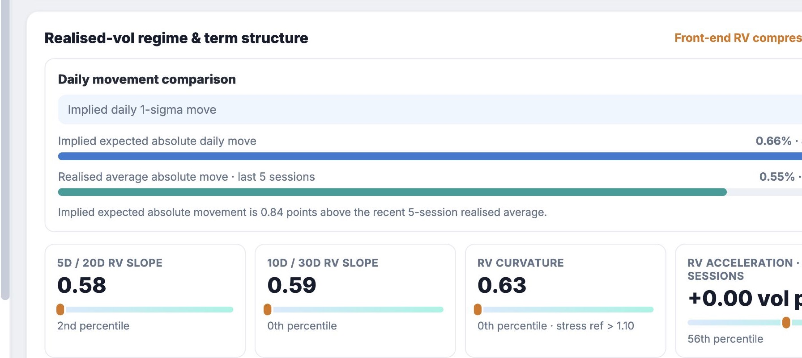
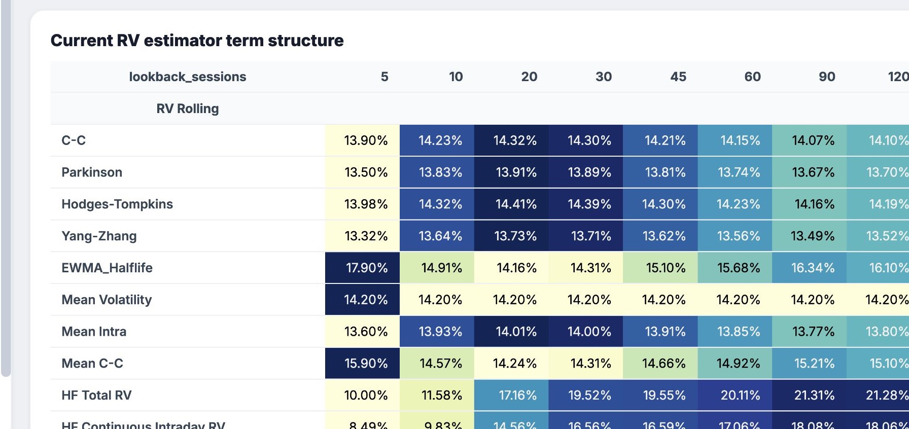
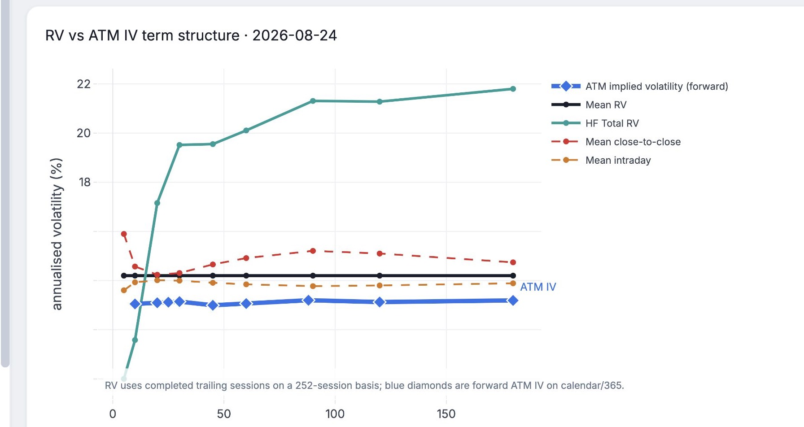

# skewlab

**An arbitrage-aware option skew and volatility dashboard.** skewlab fits an SVI smile,
recovers the risk-neutral density, checks static arbitrage, and compares implied volatility
with realised-volatility levels and term structures.

[](https://github.com/reubenB412/skewlab/actions/workflows/ci.yml)


> **Runs offline.** The public demo uses deterministic synthetic data. It reads no credentials,
> market-data terminal, network service, or portfolio file.


*The summary joins the fitted surface, changes from the prior observation, regime percentiles,
position Greeks, arbitrage checks, and RV-versus-IV fair value.*

## Why I built it

I use skewlab to organise the daily questions behind a discretionary options book: where skew
sits, whether implied volatility is rich or cheap to realised volatility, what distribution the
surface implies, and how an existing position responds. The public repository keeps the maths,
dashboard, and tests while replacing the market-data connection with a reproducible adapter.

The dashboard works best on liquid option chains. Thin strikes, wide spreads, stale quotes, and
after-hours data weaken the fit and should reduce confidence in the output.

## What it calculates

- **SVI skew:** fits total implied variance in log-moneyness and checks the Durrleman butterfly
  condition. A polynomial fit remains available for comparison.
- **Risk-neutral density:** applies the Breeden-Litzenberger second derivative to fitted call
  prices and reports distribution moments.
- **Implied versus realised:** compares the market ATM-forward straddle with a realised-volatility
  fair value on a consistent trading-day clock.
- **RV regime:** aggregates daily variance across 5 to 180 completed sessions, with separate
  intraday, overnight, continuous, and jump components.
- **Forward ATM-IV:** aligns 10 to 180-day maturities by observation date and actual DTE. Stale
  maturities remain in diagnostics but are not plotted.
- **Position analytics:** calculates analytic Greeks and a realised-volatility, vega, and delta
  P&L decomposition for an optional manual book.

## How the core models work

**SVI** fits a five-parameter curve to total implied variance as a function of log-moneyness.
This produces a smooth volatility smile between observed strikes and linear behaviour in the
wings. skewlab then evaluates the Durrleman condition across the fitted curve; negative values
indicate butterfly arbitrage.

**Breeden-Litzenberger** recovers the market's risk-neutral density from the second derivative
of fitted call prices with respect to strike. skewlab calculates that derivative on the smooth
SVI surface, then checks that the density remains non-negative and integrates to approximately
one. The result describes option-implied probabilities under risk-neutral pricing, not a forecast
of the future return distribution.

## Quickstart

```bash
git clone https://github.com/reubenB412/skewlab.git
cd skewlab
python -m venv .venv && source .venv/bin/activate
pip install -r requirements.txt
python skewlab.py
```

The dashboard opens at `http://127.0.0.1:8050`. Change the `INPUTS` block in
[`skewlab.py`](skewlab.py) to select a symbol, target DTE, skew model, or manual position book.

## Worked demo: SPY, 24 August 2026

The deterministic example uses a synthetic SPY chain with spot at 751.34, forward at 752.81,
23 calendar days to expiry, and 13.11% ATM-forward implied volatility. The RV source contains
399 completed sessions. The unfinished final session is excluded. All eight configured ATM-IV
maturities, from 10 to 180 days, align to the same observation date.

The fitted RV curve is labelled **Front-end RV compressed**. Its `RV(5)/RV(20)` ratio is 0.583
and `RV(10)/RV(30)` is 0.593. Short-window realised volatility therefore sits below the slower
windows. This is a baseline, not a long-straddle signal. A possible early tremor would require
the front ratios and short-window acceleration to rise while the option market had not already
repriced the move.

That interpretation fails if the latest session is incomplete, an IV maturity is stale, the
chain is too thin to fit reliably, or the front of the implied curve already prices the expected
movement. The synthetic result demonstrates the calculation path; it does not demonstrate
tradable performance.

## Validation and limitations

The deterministic SPY run produces the following numerical checks:

- the recovered density integrates to **0.99985**, with a minimum sampled density of
  **1.19 × 10⁻⁵**;
- the minimum Durrleman `g(k)` is **0.0682** across `k ∈ [-0.5, 0.5]`, above the zero
  butterfly-arbitrage boundary;
- **399** completed RV sessions enter the history and the incomplete final session is rejected;
- all **8** configured ATM-IV maturities align and plot;
- **26 tests** cover pricing identities, variance arithmetic, stale-date rejection, display
  output, and the full offline pipeline. CI runs them on Python 3.10, 3.11, and 3.12.

These checks test numerical consistency and data handling. They do not establish forecast skill,
execution quality, or trading profitability. The public adapter has no live quotes, bid-ask
model, transaction costs, slippage, or portfolio-level risk limits. SVI is fitted independently
by maturity, so sparse or noisy chains can still produce unstable parameters even when the
sampled arbitrage checks pass.

## Dashboard gallery


*Raw-SVI fit with prior-observation and maturity overlays.*


*Per-strike implied-volatility change from the previous same-expiry observation.*


*Breeden-Litzenberger density from the fitted smile, compared with a flat-volatility lognormal.*



*Front-end RV slopes, curvature, acceleration, movement, and historical rank.*



*The 5 to 180-session estimator table. Front-end changes can prompt a closer look at long-gamma
conditions, but the table is not a trade signal.*



*Backward RV windows against the aligned 10 to 180-day forward ATM-IV curve.*


*ATM volatility, risk reversals, and their current historical percentiles.*


*Implied-volatility buckets against the composite realised-volatility estimate.*


*Close-to-close, range, EWMA, GARCH, and blended realised-volatility estimates.*

## Architecture

```text
skewlab/
  model.py       pricing, Greeks, SVI, density, no-arbitrage checks
  rv.py          variance recovery, aggregation, regime and term tables
  data.py        adapter boundary and immutable Snapshot
  analysis.py    calculated metrics and written interpretation
  charts/        one figure builder per chart
  app.py         Dash layout and callbacks
  pipeline/      deterministic offline data adapter
```

The quantitative functions take explicit inputs and do not perform network I/O. The data layer
builds one immutable snapshot, and the charts read that snapshot. See
[`docs/ARCHITECTURE.md`](docs/ARCHITECTURE.md) and
[`docs/METHODOLOGY.md`](docs/METHODOLOGY.md) for the design and equations.

## References

- Jim Gatheral and Antoine Jacquier, [*Arbitrage-free SVI volatility surfaces*](https://arxiv.org/abs/1204.0646),
  *Quantitative Finance* 14(1), 2014, pp. 59-71.
- Douglas T. Breeden and Robert H. Litzenberger,
  [*Prices of State-Contingent Claims Implicit in Option Prices*](https://doi.org/10.1086/296025),
  *The Journal of Business* 51(4), 1978, pp. 621-651.

## Development checks

```bash
pip install -e ".[dev]"
pytest
ruff check skewlab
```

For research and educational use. Synthetic demo data is not market data or investment advice.
