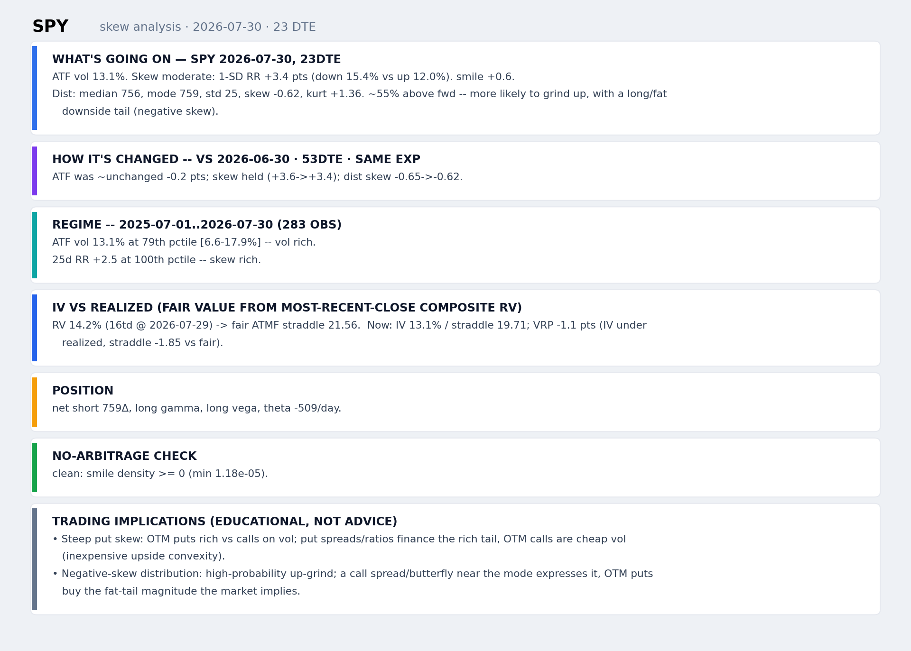
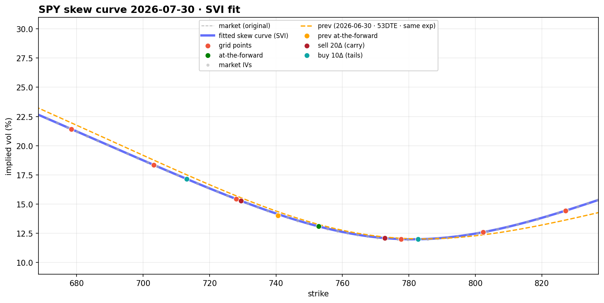
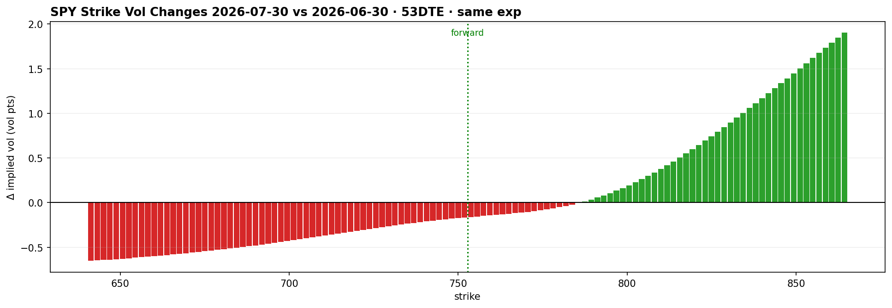
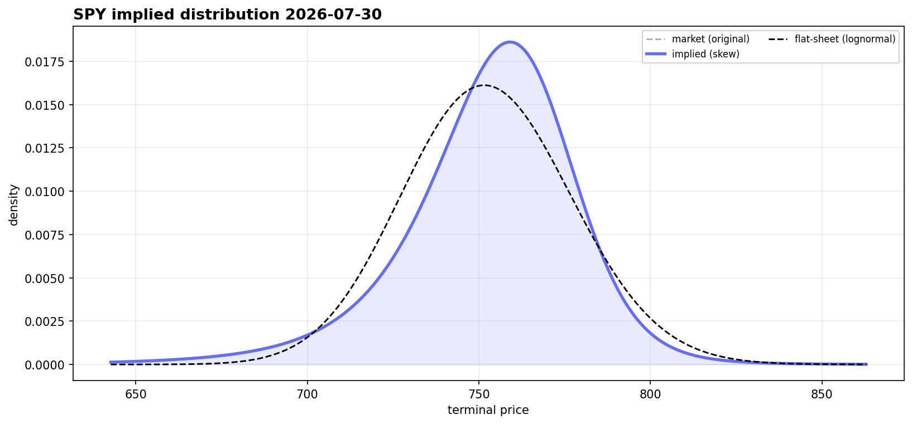
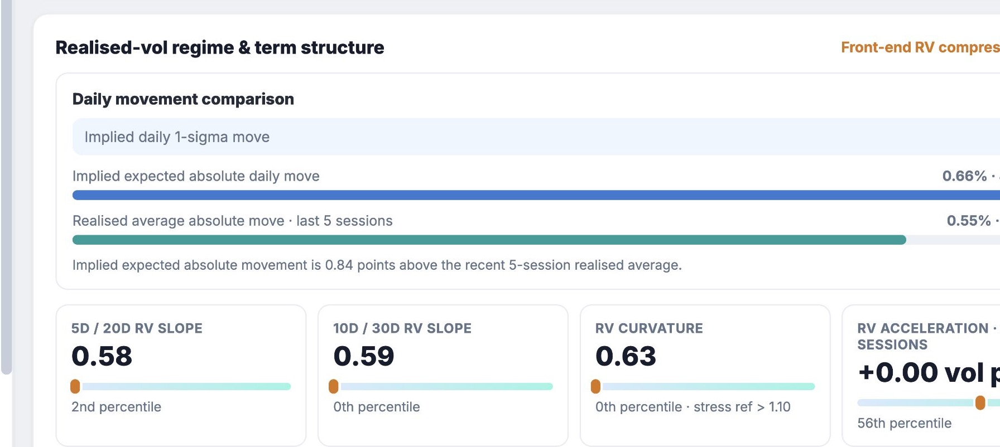
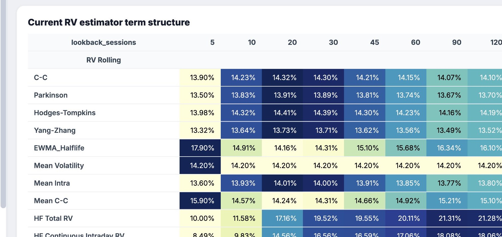
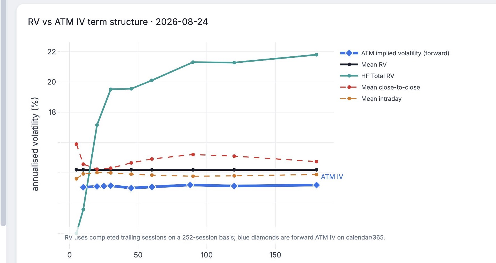
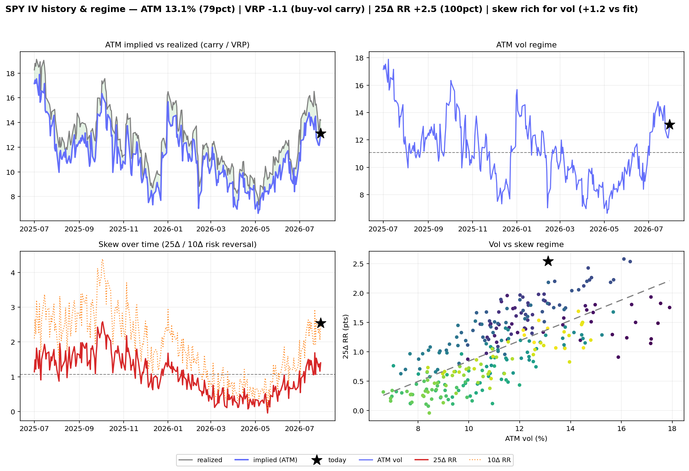
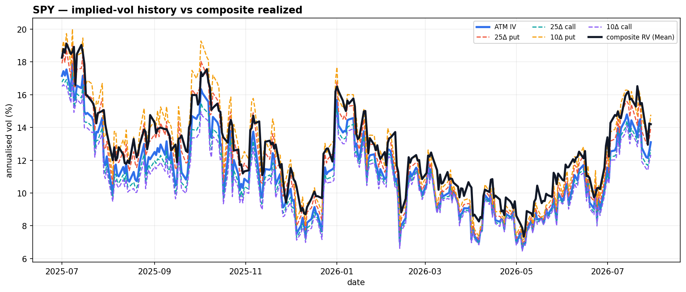
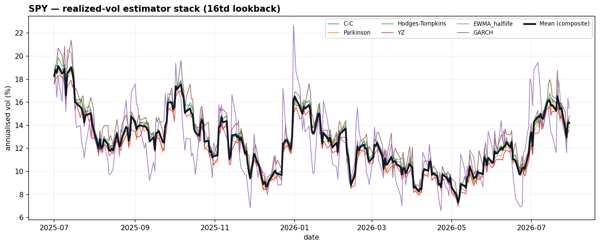

# skewlab

An option-skew and volatility dashboard built around the questions I use when looking at a
discretionary options book: where skew sits, whether implied volatility is rich or cheap to
realised volatility, and what distribution the surface implies.

[](https://github.com/reubenB412/skewlab/actions/workflows/ci.yml)


The public version runs offline on deterministic synthetic data. It does not read credentials,
a market-data terminal, network services, or portfolio files.



The summary combines the fitted surface, changes from the prior observation, regime percentiles,
position Greeks, arbitrage checks, and RV-versus-IV fair value.

## What it calculates

- **SVI skew:** fits total implied variance in log-moneyness and checks the Durrleman butterfly
  condition. A polynomial fit remains available for comparison.
- **Risk-neutral density:** applies the Breeden-Litzenberger second derivative to fitted call
  prices and reports distribution moments.
- **Implied versus realised:** compares the ATM-forward straddle with a realised-volatility fair
  value on a consistent trading-day clock.
- **RV regime:** aggregates daily variance across 5 to 180 completed sessions, separating
  intraday, overnight, continuous, and jump components.
- **Forward ATM-IV:** aligns 10 to 180-day maturities by observation date and actual DTE. Stale
  maturities remain in diagnostics but are not plotted.
- **Position analytics:** calculates Greeks and a realised-volatility, vega, and delta P&L
  decomposition for an optional manual book.

SVI provides a smooth smile with linear wings. Breeden-Litzenberger turns the fitted call-price
curve into risk-neutral probabilities. The equations, variance clocks, fitting choices, and
failure cases are in [the methodology](docs/METHODOLOGY.md).

## Run the demo

```bash
git clone https://github.com/reubenB412/skewlab.git
cd skewlab
python -m venv .venv && source .venv/bin/activate
pip install -r requirements.txt
python skewlab.py
```

The dashboard opens at `http://127.0.0.1:8050`. Edit the `INPUTS` block in
[`skewlab.py`](skewlab.py) to change the symbol, target DTE, skew model, or manual position book.

## Worked demo: SPY, 24 August 2026

The fixed example uses a synthetic SPY chain with spot at 751.34, forward at 752.81, 23 calendar
days to expiry, and 13.11% ATM-forward implied volatility. It contains 399 completed RV sessions
and eight aligned ATM-IV maturities.

The RV curve is labelled **Front-end RV compressed**. `RV(5)/RV(20)` is 0.583 and
`RV(10)/RV(30)` is 0.593, so short-window realised volatility sits below the slower windows.
This alone is not a long-straddle signal. I would look for the front ratios and short-window
acceleration to rise before the option market reprices the move.

The interpretation fails if the latest session is incomplete, an IV maturity is stale, the
chain is too thin to fit, or the implied curve already prices the expected movement. The example
demonstrates the calculation path, not tradable performance.

## Validation and limitations

Reproduce the documented numerical checks with:

```bash
python -m skewlab.validate
pytest -q
```

The fixed run returns a density integral of 0.99985, minimum sampled density of
1.19 × 10⁻⁵, minimum Durrleman `g(k)` of 0.0682 on `k ∈ [-0.5, 0.5]`, 399 completed RV sessions,
and eight aligned ATM-IV maturities. CI runs the tests on Python 3.10, 3.11, and 3.12.

These are consistency and data-handling checks. They do not establish forecast skill, execution
quality, or profitability. The public adapter has no live quotes, bid-ask model, transaction
costs, slippage, or portfolio-level risk limits. SVI is fitted independently by maturity, so a
sparse chain can produce unstable parameters even when the sampled checks pass.

## Dashboard gallery



*Raw SVI fit with prior-observation and maturity overlays.*



*Per-strike implied-volatility change from the previous same-expiry observation.*



*Breeden-Litzenberger density against a flat-volatility lognormal.*



*Front-end RV slopes, curvature, acceleration, movement, and historical rank.*



*Five to 180-session realised-volatility estimates.*



*Backward RV windows against the aligned forward ATM-IV curve.*



*ATM volatility, risk reversals, and their historical percentiles.*



*Implied-volatility buckets against the composite realised-volatility estimate.*



*Close-to-close, range, EWMA, GARCH, and blended estimates.*

## Code layout

```text
skewlab/
  model.py       pricing, Greeks, SVI, density, arbitrage checks
  rv.py          variance recovery, aggregation, regime and term tables
  data.py        adapter boundary and Snapshot assembly
  analysis.py    calculated metrics and written interpretation
  charts/        figure builders
  app.py         Dash layout and callbacks
  pipeline/      deterministic offline adapter
```

The quantitative functions take explicit inputs and do not perform network I/O. See
[the architecture notes](docs/ARCHITECTURE.md) for the adapter boundary and chart registry.

## References

- Jim Gatheral and Antoine Jacquier, [*Arbitrage-free SVI volatility surfaces*](https://arxiv.org/abs/1204.0646),
  *Quantitative Finance* 14(1), 2014, pp. 59-71.
- Douglas T. Breeden and Robert H. Litzenberger,
  [*Prices of State-Contingent Claims Implicit in Option Prices*](https://doi.org/10.1086/296025),
  *The Journal of Business* 51(4), 1978, pp. 621-651.

## Development checks

```bash
pip install -e ".[dev]"
pytest
ruff check skewlab
```

For research and educational use. Synthetic demo data is not market data or investment advice.
